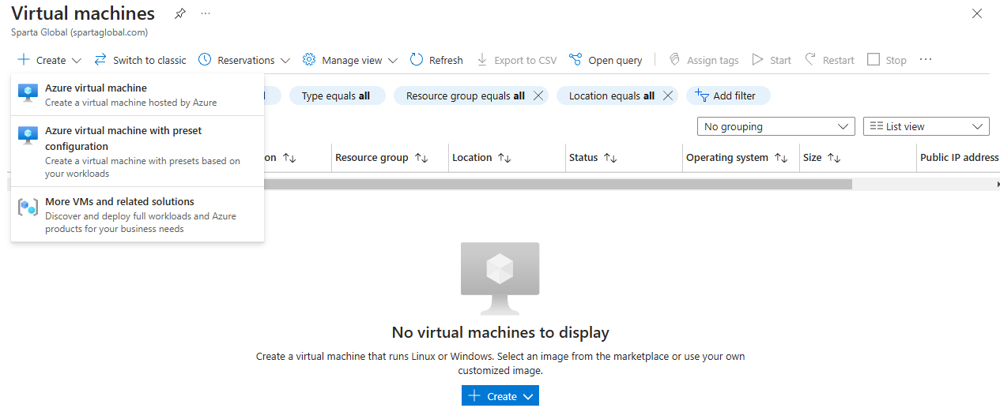
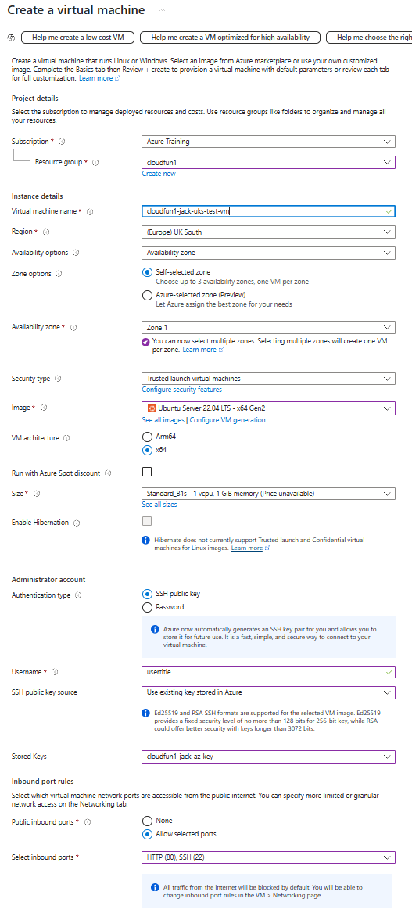
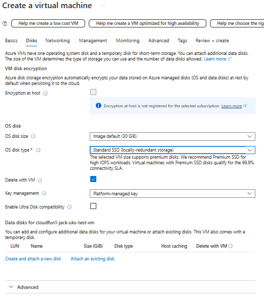
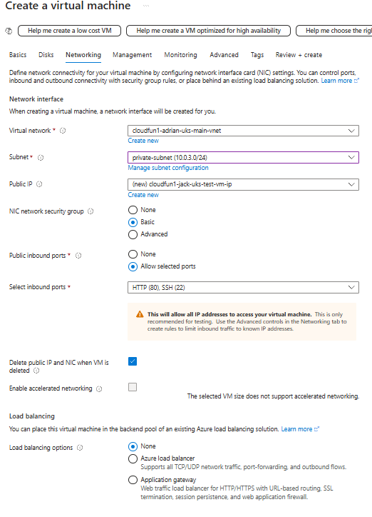
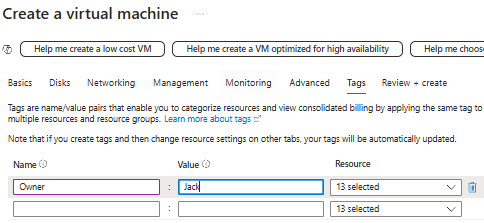
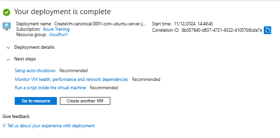
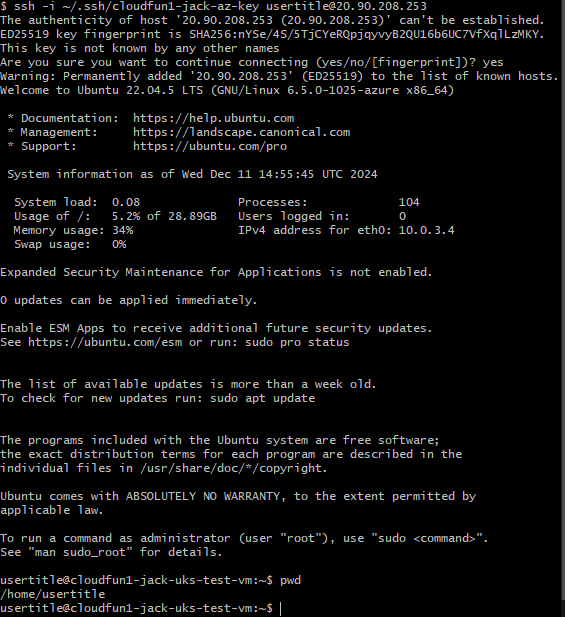
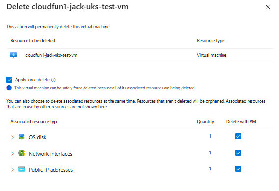

# Creating a Virtual machine

## Move to Virtual machine on azure portal and select first create option

## basics tab

## Disks tab
### disk type to standard

## Networking tab
### pick Virtual Net and Subnet
### Check Delete IP when deleted
### select ports

## Management is fine

## Monitoring is fine

## Advanced is fine may use user data later

## Tag tab
### add owner tag and any others req

## Review + Create
### do your due diligence errors are expensive
## Working

## connect via Bash
### on the resource use the connect to find the Native SSH and get prompted a command *ssh -i ~/.ssh/cloudfun1-jack-az-key usertitle@20.90.208.253* then yes as new host

### then exit

## Delete the VM with all data
